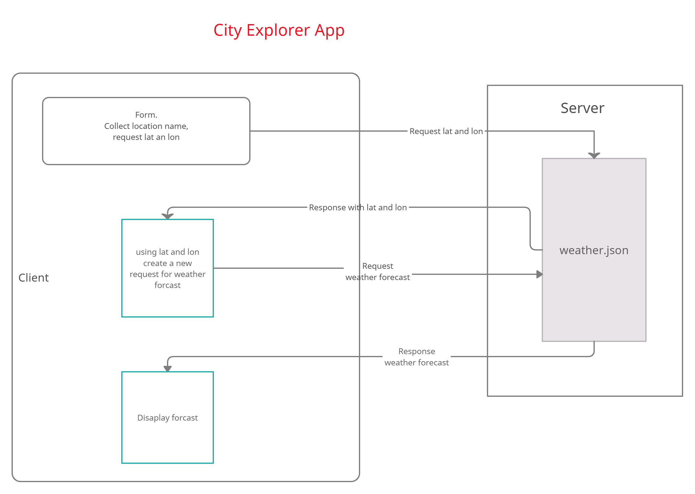

# city-explorer-api

**Author**: Clarissa

**Version**: 1.0.0 (increment the patch/fix version number if you make more commits past your first submission)

## Overview

Setting up a server for the city explorer app.

As a user of City Explorer, I want to see weather info for the city I searched, so that I know how to pack for an upcoming trip.

As a user, I want clear messages if something goes wrong so I know if I need to make any changes or try again in a different manner.

## Getting Started

npm install: express, dotenv, and cors.

Make sure to add .gitignore and .eslintrc.json

Set the contents of .env to set a value for `PORT`. Ensure `.env` is in your `.gitignore` file.

<!-- What are the steps that a user must take in order to build this app on their own machine and get it running? -->

## Architecture
<!-- Provide a detailed description of the application design. What technologies (languages, libraries, etc) you're using, and any other relevant design information. -->

## Change Log
<!-- Use this area to document the iterative changes made to your application as each feature is successfully implemented. Use time stamps. Here's an example:

01-01-2001 4:59pm - Application now has a fully-functional express server, with a GET route for the location resource. -->

## Credit and Collaborations

Ayrat Gimranov

---

Name of feature: Lab 07 Custom Servers with Node and Express

Estimate of time needed to complete: 2 days

Start time: 7/31

Finish time: _____

Actual time needed to complete: _____

